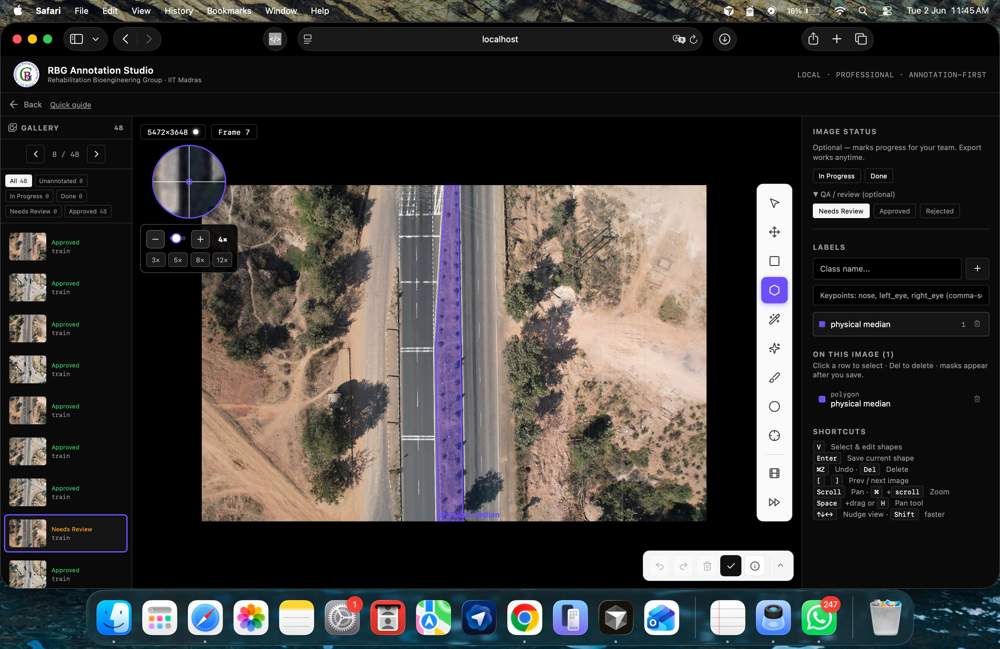

# RBG Annotation Studio



A self-hosted, multi-user image **annotation studio** — draw bounding boxes,
polygons, keypoints, ellipses and brush masks on images, review them, and export
the labels as **COCO JSON**, **YOLO**, or a ready-to-train **labeled bundle**
(images + drawn overlays + labels).

Built as a **FastAPI** (Python) backend + **React/Vite** frontend, backed by
**PostgreSQL**, with role-based access and one assigned annotator per project.

You deploy it once on a server; everyone works in their browser at the same URL.

> Internal project — RBG LABS · COERS (Centre of Excellence for Road Safety).

---

## Table of contents

1. [Feature overview](#feature-overview)
2. [Repository layout](#repository-layout)
3. [Architecture & data flow](#architecture--data-flow)
4. [Quick start with Docker (recommended)](#quick-start-with-docker-recommended)
5. [Run locally for development](#run-locally-for-development)
6. [Deploy on a physical server](#deploy-on-a-physical-server)
7. [Configuration & default credentials](#configuration--default-credentials)
8. [Roles: admin vs user](#roles-admin-vs-user)
9. [Using the app](#using-the-app)
10. [Exporting labels](#exporting-labels)
11. [Backups](#backups)
12. [Documentation index](#documentation-index)

---

## Feature overview

- **Annotation tools:** bounding box, polygon, ellipse, keypoint/skeleton, and a
  raster **brush mask** with add/erase, select, resize, undo/redo.
- **Two roles:** `admin` (full control) and `user` (annotates only what they're
  assigned). See [Roles](#roles-admin-vs-user).
- **One annotator per project:** an admin creates accounts and assigns each
  project to exactly one user. That user sees only their assigned projects;
  admins see everything. Reassigning a project moves its files to the new owner.
- **Per-user file storage:** every project's images, annotation backups and
  exports live under the assigned user's own folder on disk.
- **Review workflow:** mark images In-progress / Done / Needs-review /
  Approved / Rejected; approved images are frozen to everyone but an admin.
- **Dataset versions & splits:** snapshot a dataset, auto-split train/val/test.
- **Exports:** COCO JSON, YOLO zip, and a one-click "labeled bundle" zip —
  available to the assigned user as well as admins.
- **Full audit log:** every mutation writes a row to `activity_log`, mirrored to
  a plain-text `activity.log` in the user's folder.

**Not included:** simultaneous editing of the same image by two people, and
ML-assisted auto-labelling (SAM / GroundingDINO). Both existed in an earlier
version of this project and were deliberately removed; see the
[archive repository](https://github.com/rochitl72/RBG-Label-Studio) if you need
them back.

---

## Repository layout

```
lable-studio-latest-org/
├── backend/                     # FastAPI application
│   ├── app/
│   │   ├── main.py              # app entrypoint + router registration
│   │   ├── core/               # config + security (JWT, hashing, role gates)
│   │   ├── db/                 # engine, session, bootstrap/seed logic
│   │   ├── models/             # SQLAlchemy ORM models (the DB schema)
│   │   ├── api/                # HTTP routers, grouped by domain:
│   │   │   ├── auth/           #   login, users
│   │   │   ├── workspace/      #   projects, images, annotations
│   │   │   ├── dataset/        #   versions, splits, workflow, export
│   │   │   └── admin/          #   dashboards, activity feed
│   │   └── services/           # membership, storage, activity log, metrics, export
│   ├── alembic/                # database migrations
│   ├── requirements.txt
│   ├── Dockerfile
│   ├── entrypoint.sh           # waits for DB → alembic upgrade head → uvicorn
│   └── .env.example            # every backend setting, documented
├── frontend/                    # React + Vite single-page app
│   ├── src/
│   │   ├── components/         # UI, grouped: annotate/ admin/ auth/ projects/ …
│   │   ├── store/             # Zustand stores (editor state, undo/redo history)
│   │   ├── lib/              # api client, auth helper, API base-URL config
│   │   └── utils/           # geometry, RLE mask encode/decode, colors
│   ├── Dockerfile             # multi-stage build → nginx
│   └── nginx.conf            # serves the SPA + proxies /api and /health
├── docs/                        # architecture, data-flow, diagrams, planning
├── scripts/                     # ops helpers (e.g. backup.sh)
├── docker-compose.yml           # one-command full-stack deployment
├── .env.example                 # compose secrets template
└── README.md
```

---

## Architecture & data flow

Two diagrams and a detailed walkthrough live in `docs/`:

- **`docs/ARCHITECTURE.md`** — narrative tour of the whole system.
- **`docs/DATA_FLOW.md`** — action-by-action table of what every user/admin
  action writes, and where.
- **`docs/diagrams/backend_flow.mermaid`** — request-flow diagram.
- **`docs/diagrams/db_er.mermaid`** — full database entity-relationship model.

In one paragraph: the browser talks to FastAPI over plain REST — there is no
WebSocket. FastAPI persists **all structured data** (accounts, projects,
assignments, image metadata, annotations, audit log) in **PostgreSQL**, and
stores the **image files themselves on disk** (the DB only keeps the path).
Every request passes the same gate order — authenticate (JWT) → role check →
project access → do the work → write an audit row. Annotations are saved the
moment you finish a shape; nothing is buffered in the browser.

---

## Quick start with Docker (recommended)

Requires only **Docker** + **Docker Compose**. This brings up PostgreSQL, the
API, and the web UI together.

```bash
# 1. clone
git clone https://github.com/rochitl72/lable-studio-latest-org.git
cd lable-studio-latest-org

# 2. create your secrets file
cp .env.example .env
#    then edit .env — at minimum set SECRET_KEY and BOOTSTRAP_ADMIN_PASSWORD
#    generate a strong key:  python3 -c "import secrets; print(secrets.token_urlsafe(32))"

# 3. build & start
docker compose up -d --build

# 4. open the app
#    http://localhost:8080   (change the port with WEB_PORT in .env)
```

Log in with the `BOOTSTRAP_ADMIN_USERNAME` / `BOOTSTRAP_ADMIN_PASSWORD` you set
in `.env`. Data persists in named Docker volumes (`pgdata`, `storage`,
`exports`) across restarts.

```bash
docker compose logs -f          # watch logs
docker compose down             # stop (keeps data)
docker compose down -v          # stop AND delete all data volumes
```

---

## Run locally for development

For hacking on the code with hot-reload. The app is **PostgreSQL-only**, so dev
needs a Postgres too — the quickest is a throwaway one in Docker (the app itself
still runs from source with hot-reload).

**Prerequisites:** Python 3.10+, Node.js 18+ LTS, Docker (for Postgres), Git.

### 1. Start a local Postgres (terminal 1)

```bash
docker run --name rbg-dev-pg -e POSTGRES_USER=annoforge \
  -e POSTGRES_PASSWORD=annoforge -e POSTGRES_DB=annoforge \
  -p 5432:5432 -d postgres:16-alpine
```

### 2. Backend (terminal 2)

```bash
cd backend
python3 -m venv .venv
source .venv/bin/activate            # Windows: .venv\Scripts\activate

pip install -r requirements.txt

cat > .env <<'EOF'
POSTGRES_HOST=localhost
POSTGRES_PORT=5432
POSTGRES_USER=annoforge
POSTGRES_PASSWORD=annoforge
POSTGRES_DB=annoforge
SECRET_KEY=dev-secret-not-for-production
EOF

uvicorn app.main:app --host 0.0.0.0 --port 8000 --reload
```

On first start the backend applies the migrations and seeds one admin account:

| Username | Password | Role  |
|----------|----------|-------|
| `admin`  | `123`    | admin |

Add `SEED_TEST_USER=true` to that `.env` if you also want a plain-user `test` /
`123` account to try the non-admin view. It is **off by default** so it can
never accidentally ship to a deployment.

### 3. Frontend (terminal 3)

```bash
cd frontend
npm install
npm run dev
```

Open **http://localhost:5173**. Vite proxies `/api` to the backend on `:8000`,
so you talk to one origin.

> Migrations: the Docker deployment runs `alembic upgrade head` automatically on
> container start (see `backend/entrypoint.sh`). Running from source as above,
> the app creates any missing tables itself on first boot — but if you change
> the models, generate and apply a migration:
> `alembic revision --autogenerate -m "..."` then `alembic upgrade head`.

Image files and annotation/log backups are written under `backend/storage/` in
dev; the database holds only the paths.

---

## Deploy on a physical server

The Docker Compose stack is the supported production path. On a fresh Linux
server (Ubuntu 22.04+ shown):

### 1. Install Docker

```bash
curl -fsSL https://get.docker.com | sh
sudo usermod -aG docker "$USER"      # log out/in so this applies
```

### 2. Get the code and configure secrets

```bash
git clone https://github.com/rochitl72/lable-studio-latest-org.git
cd lable-studio-latest-org
cp .env.example .env
nano .env
```

In `.env`, for a real deployment you **must** set:

```bash
SECRET_KEY=<output of: python3 -c "import secrets; print(secrets.token_urlsafe(32))">
BOOTSTRAP_ADMIN_PASSWORD=<a strong password>
POSTGRES_PASSWORD=<a strong db password>
SEED_TEST_USER=false
WEB_PORT=8080
COOKIE_SECURE=true            # set true once you serve over HTTPS
```

The backend container runs with `ENVIRONMENT=production`, which **refuses to
start** if `SECRET_KEY` is unset or the admin password is left at the default —
a deliberate fail-loud guard. In production the minimum password length is also
forced back up to 8.

On start the backend waits for PostgreSQL, runs `alembic upgrade head`, then
launches the API (`backend/entrypoint.sh`). The web container waits for the
API's healthcheck to pass before accepting traffic, so the first page load
never 502s.

### 3. Launch

```bash
docker compose up -d --build
docker compose ps                 # all services healthy?
```

The app is now on `http://<server-ip>:8080`.

### 4. Put HTTPS in front (recommended)

Terminate TLS with a reverse proxy (Caddy or nginx) on the host and point it at
`127.0.0.1:${WEB_PORT}`. Minimal Caddy example:

```
studio.example.com {
    reverse_proxy 127.0.0.1:8080
}
```

Then set `COOKIE_SECURE=true` in `.env` and `docker compose up -d` again so the
auth cookie is only sent over HTTPS.

### 5. Updating a deployed instance

```bash
cd lable-studio-latest-org
git pull
docker compose up -d --build      # schema self-migrates on boot
```

---

## Configuration & default credentials

All backend settings are documented in **`backend/.env.example`**; the compose
secrets are in the repo-root **`.env.example`**. Highlights:

| Setting | Meaning |
|---|---|
| `SECRET_KEY` | Signs login tokens. Required in production. |
| `ENVIRONMENT` | `development` (relaxed) or `production` (fail-loud guards on). |
| `BOOTSTRAP_ADMIN_USERNAME` / `_PASSWORD` | First admin, seeded on an empty DB. |
| `SEED_TEST_USER` | Seed a demo `test` user — set `false` in production. |
| `DATABASE_URL` | Full PostgreSQL URL (`postgresql+asyncpg://…`). Leave blank to build one from the `POSTGRES_*` vars. |
| `DB_POOL_SIZE` / `DB_MAX_OVERFLOW` | Connection pool sizing. |
| `COOKIE_SECURE` | `true` when served over HTTPS. |
| `MIN_PASSWORD_LENGTH` | Dev convenience; auto-raised to 8 in production. |

**Default dev logins:** `admin` / `123` and `test` / `123`. Change them before
exposing the app to anyone.

---

## Roles: admin vs user

| Capability | admin | user |
|---|:--:|:--:|
| Create / manage user accounts | ✅ | — |
| Create / delete projects | ✅ | — |
| Upload images | ✅ | — |
| Assign a project to a user | ✅ | — |
| Add / edit / delete annotations | ✅ (any) | ✅ (own, on assigned projects) |
| Approve / reject images | ✅ | — |
| Dataset versions / splits | ✅ | — |
| Export labels (COCO / YOLO / bundle) | ✅ | ✅ (assigned projects) |
| View team dashboards & activity | ✅ | — |
| See personal progress page | ✅ | ✅ |

A plain user can only reach a project after an admin assigns it to them, and a
project has exactly one assigned user at a time. Everything else on that project
(upload, review, versions, delete) stays admin-only.

Accounts are never hard-deleted — an admin deactivates them instead, so their
past annotations keep a valid author. The last active admin cannot be demoted or
deactivated.

---

## Using the app

1. Sign in and (as admin) **create a project**, then assign it to a user — a
   project must have an assigned user before images can be uploaded, because its
   files live under that user's folder on disk.
2. **Upload** images, then add label classes in the right panel (`+`).
3. The assigned user signs in and sees the project on their home screen.
4. Annotate with the toolbar — keyboard shortcuts:
   `B` box · `P` polygon · `E` ellipse · `K` brush · `J` keypoint ·
   `[` / `]` brush size · `X` toggle erase · `⌘/Ctrl+Z` undo.
5. Set an image's status / send it for review from the top control strip.

Annotations save automatically the instant you finish a shape — there is no
"save" button.

---

## Exporting labels

An admin, or the project's assigned user, can download its labels from the
project header:

- **Labeled zip** — original images + overlay copies (labels drawn on) + YOLO
  `.txt` + one COCO json + `classes.txt` + `manifest.json`.
- **COCO JSON** — standard COCO schema (supports RLE masks).
- **YOLO zip** — images + YOLO labels + `data.yaml`, split into train/val/test.

Admins additionally get **Save to server Downloads**, which writes the same
bundle into the server's own filesystem (an ops action).

---

## Backups

`scripts/backup.sh` dumps PostgreSQL (custom format) and tars the image storage
directory, with retention pruning. Configure paths via `backend/.env` and run it
from cron on the server. For the Docker deployment, back up the `pgdata` and
`storage` volumes.

---

## Documentation index

| File | What it covers |
|---|---|
| `docs/ARCHITECTURE.md` | End-to-end system walkthrough. |
| `docs/DATA_FLOW.md` | Every action → where it's stored (per role). |
| `docs/diagrams/backend_flow.mermaid` | Backend request-flow diagram. |
| `docs/diagrams/db_er.mermaid` | Database ER model. |
| `docs/planning/` | Historical plans. **Superseded** — these describe the earlier multi-user / desktop-launcher design, not the current app. |
| `backend/app/README.md` | Backend folder map. |
| `frontend/src/README.md` | Frontend folder map. |

---

*RBG LABS · COERS — internal annotation tooling.*
